# Tau Ceti REBOUND stability check

Run date 2026-09-30. REBOUND 5.2.1, matplotlib 3.11.2, numpy 2.5.2, Python 3.13. Setting doc Draft v2.40, read only. This report does not change that doc.

## 1. Answer first

The giant pair is **stable** through **100 Myr** (MEGNO stays at 2.00 through **1 Myr**; giants started at e = 0.05, and Cue Ball at 1.5× mass, are each **stable** through **20 Myr**). Kakakiko's Locked eccentricity is **marginal** over **5 Myr**: with Sable started at e = 0 the eccentricity oscillates between 0.0136 and 0.0401 on a 19,700 yr cycle, so 0.0396 is the top of that cycle, and the orbit does not cross Sable's. Der's published orbit is **unstable** with the star: Shudder leaves the [0.5a, 2a] band at **4.54 yr**, while Der is still inside Kakakiko's Hill sphere at that instant; the same initial conditions with the star removed stay bound for **50,000 yr**. Croquet Ball's L4 cloud is **stable** through **4.54 Myr** and its L5 cloud is **stable** through **4.54 Myr** (25/25 tadpoles at each point). Yard (Kakakiko–Der L4) is **unstable** and Haven (L5) is **unstable**: all 50 particles have left tadpole orbits by **1.75 yr**, and the moon integration stops at **4.51 yr**. The Der–Shudder 2:1 is **unstable** at the published distances once the star is present (the resonant angles leave 0 and the pair disrupts within a few years in every variant tried). φ₁ librates about 0° with amplitude ±27.2° for **50,000 yr** only with the star removed. A separate suggestion, 0.60× both moon distances, keeps φ₁ librating for **20,000 yr** with the star, Sable, and Croquet Ball included.

## 2. Inputs

Values were re-read from `Tau_Cet_system_v2.md` Draft v2.40 on 2026-09-30. They match the table in the task brief. Where the doc writes a tilde on a giant semi-major axis, that number was used as the exact initial `a`. Where the doc is silent, the value is marked **default**.

Units in the integrations are year, AU, solar mass (REBOUND `G = 4π²`). Earth masses use `M⊕/M☉ = GM⊕/GM☉ = 3.0034896634×10⁻⁶`. That ratio is a **default**: the doc gives `M⊕ = 5.972×10²⁴ kg` and `1 AU = 1.496×10⁸ km`, and does not give `GM`. Kilogram masses for Kakakiko, Shudder, and Der were divided by the doc's `M⊕`, so Der/Kakakiko is exactly 1/100 and Kakakiko is 1.045378 M⊕ (the doc's 1.045 is the rounded form).

| Body | Quantity | Value used | Tag |
|---|---|---|---|
| τ Cet | mass | 0.78 M☉ | doc, real; used for every calculation |
| tC 1 Gane | a, mass | 0.133 AU, 0.06 M⊕ | doc, est. |
| tC 1 Gane | e | 0 | **default**; doc says TBD |
| tC 2 Hornstooth | a, mass | 0.243 AU, 0.08 M⊕ | doc, est. |
| tC 2 Hornstooth | e | 0 | **default**; doc does not give e |
| tC 3 Husk | a, mass | 0.34 AU, 0.10 M⊕ | doc, est. |
| tC 3 Husk | e | 0 | **default**; doc does not give e |
| tC 4 Sable | a, mass | 0.538 AU, 2 M⊕ | a doc; mass **Locked** |
| tC 4 Sable | e | 0 in the baseline; 0.05 and 0.1 in variants | **default** for the baseline. The Locked datum is the ceiling e ≤ 0.1, not a single value |
| tC 5 Kakakiko | a, e | 0.71 AU, 0.0396 | both **Locked** |
| tC 5 Kakakiko | mass | 6.243×10²⁴ kg = 1.045378 M⊕ | doc, est., derived |
| tC 5a Shudder | a, e, mass | 251,350 km, 0.20, 1.491×10²² kg | doc, est., derived (2:1 with Der). Formerly Tumbleweed |
| tC 5b Der Eindringling | a, e | 400,000 km, 0.03 | doc, est., designed for the 2:1 |
| tC 5b Der | mass | 1/100 of Kakakiko = 6.243×10²² kg | ratio **Locked** |
| tC 6 Croquet Ball | a, mass | 2.8 AU, 95 M⊕ | doc, est.; the tilde was taken as exact |
| tC 6 Croquet Ball | e | 0 in the baseline; 0.05 in run A_e05 | **default**; doc does not give e |
| tC 7 Cue Ball | a, mass | 5.5 AU, 17 M⊕ | doc, est.; tilde taken as exact |
| tC 7 Cue Ball | e | 0 baseline; 0.05 in A_e05; mass ×1.5 in A_cue15 | e is a **default** |
| tC 8 Eight Ball | a | 9.2 AU | doc, est.; tilde taken as exact |
| tC 8 Eight Ball | mass | 13 M⊕ | **Locked** |
| tC 8 Eight Ball | e | 0 baseline; 0.05 in A_e05 | **default** |
| All planets | i, ω, Ω | 0 | **default**; doc is silent |
| Planet mean anomalies | radians, seed 20260930 | Gane 2.6224, Hornstooth 2.3034, Husk 1.9039, Sable 2.0713, Kakakiko 0.9881, Croquet 2.4344, Cue 4.3483, Eight 4.6969 | **default**, numpy PCG64, one draw per planet in that order |
| Moon phase, baseline | both M = 0, both ω = 0, so φ₁ = φ₂ = 0 | conjunction at Shudder's perigee | **default** reading of the doc's prose. The doc gives no numerical angles |
| Moon plane, baseline | Kakakiko's orbital plane | | **default**. The 12° axial tilt is a separate variant |
| Croquet Trojan cloud | ±0.01 AU, ±5° longitude, 5×5 = 25 particles per point | | the spread is the task's specification |
| Der Trojan cloud | ±1% of Der's a, ±5°, 25 per point | | **default**; the doc does not specify the Yard/Haven particle spread |

Adjacent mutual-Hill spacings recomputed with these masses match the doc's printed values: Gane–Hornstooth 103.69 (doc 103.7), Hornstooth–Husk 54.23 (54.2), Husk–Sable 32.41 (32.4), Sable–Kakakiko 17.50 (17.5), Kakakiko–Croquet 23.93 (23.9), Croquet–Cue 12.42 (12.4), Cue–Eight 14.91 (14.9). Kakakiko's Hill radius is 1.1715×10⁶ km (doc 1.171×10⁶). The moon mutual Hill radius is 52,249 km (doc 52,250) and the spacing is 2.845 (doc 2.85). Two-body `P_Der/P_Shudder`, including each moon's mass, is 1.999995. The initial osculating `n_Shudder/(2 n_Der)` is 0.99999760. Shudder's period is 14.179 d and Der's is 28.358 d (doc 14.18 d and 28.36 d).

Every integration was moved to the center-of-mass frame. Run A folds Gane+Hornstooth+Husk+Sable (2.24 M⊕ = 6.728×10⁻⁶ M☉) into the star. That is a fractional stellar-mass change of 8.6×10⁻⁶.

## 3. Checks

Common stop rules, in every run: a body's distance from its own primary (the star, or Kakakiko for a moon) leaving `[0.5 a0, 2 a0]`; a planet–planet separation under 1 mutual Hill radius; a moon–moon separation under 0.8 mutual Hill radii (so the resonant close approach itself is not a stop); Der passing outside Kakakiko's Hill sphere. WHFast uses Jacobi coordinates, corrector 17, and a timestep of `0.99 × Pmin/20`, which is under 1/20 of the shortest period in that run. IAS15 uses `epsilon = 1×10⁻⁹`. Relative energy error is `|E − E0| / |E0|`.

### 3.1 Giant pair: stable through 100 Myr

Model A is the star (inner planets folded in), Kakakiko, Croquet Ball, Cue Ball, and Eight Ball.

| Run | Integrator | dt (yr) | Span | Wall | max rel. energy error | Stop |
|---|---|---|---|---|---|---|
| A baseline, giant e = 0 | WHFast | 0.033531 | **100 Myr** | 1884 s | 2.06×10⁻¹⁰ | reached target |
| A_e05, giant e = 0.05 | WHFast | 0.033531 | **20 Myr** | 383 s | 5.80×10⁻¹¹ | reached target |
| A_cue15, Cue mass ×1.5 (25.5 M⊕) | WHFast | 0.033531 | **20 Myr** | 379 s | 3.80×10⁻¹¹ | reached target |
| A_megno, same bodies as A | WHFast, safe_mode on (required for MEGNO) | 0.033531 | **1.00 Myr** | 1563 s | 1.32×10⁻¹⁰ | reached target |

Shortest period in A is Kakakiko's, 0.677401 yr.

Baseline, over 100 Myr:

| Body | a (AU) | e |
|---|---|---|
| Kakakiko | 0.709999 – 0.710019 | 0.039387 – 0.039780 |
| Croquet Ball | 2.79991 – 2.80022 | ≤ 5.28×10⁻⁴ |
| Cue Ball | 5.49401 – 5.50949 | ≤ 0.002591 |
| Eight Ball | 9.19062 – 9.22387 | ≤ 0.002732 |

Croquet–Cue period ratio stays in 2.74836 – 2.75988, around 11/4 = 2.75. The resonant angle of that commensurability was not computed, so this is a period-ratio range, not a detection of a locked resonance. Minimum separation of Croquet and Cue is 2.6847 AU, which is 12.3 mutual Hill radii (mutual Hill radius 0.2174 AU). Cue–Eight minimum separation is 3.672 AU (14.8 mutual Hill radii). Kakakiko–Croquet minimum separation is 2.060 AU, the same number the doc gets from the orbital geometry. No radial stop and no Hill-sphere crossing.

MEGNO over 1 Myr rises from 0 to 2 and then stays there: the recorded maximum is 2.0035 and the final value is 2.00006. The Lyapunov exponent samples are ≤ 0 (the final sample is −4×10⁻¹⁰ yr⁻¹). There is no positive exponent in the output, so a Lyapunov time is not measured and is longer than this 1 Myr. That is regular motion over the span, in the outer system only.

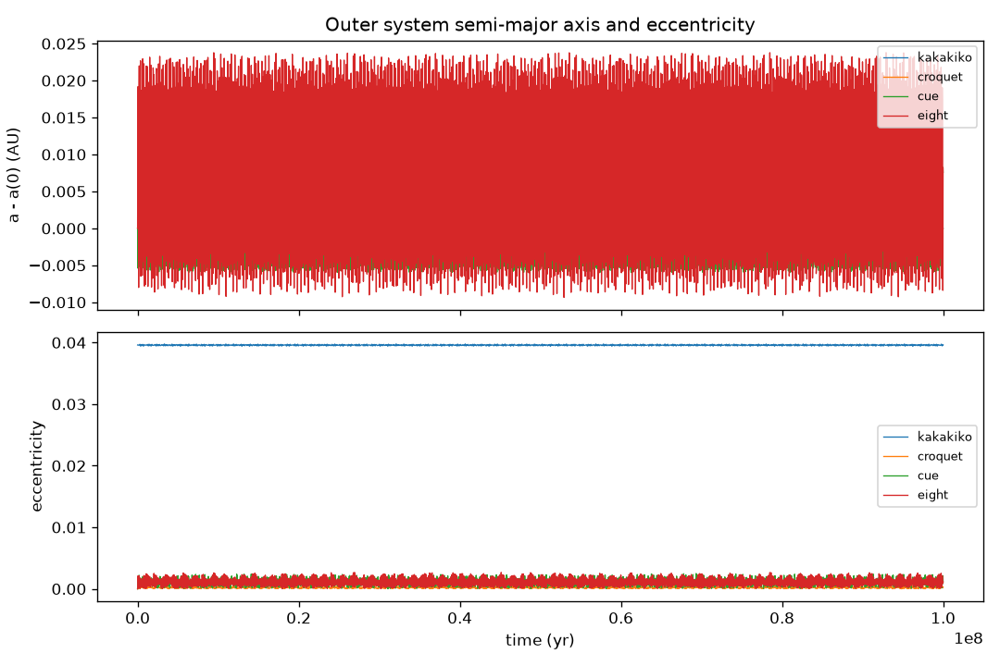

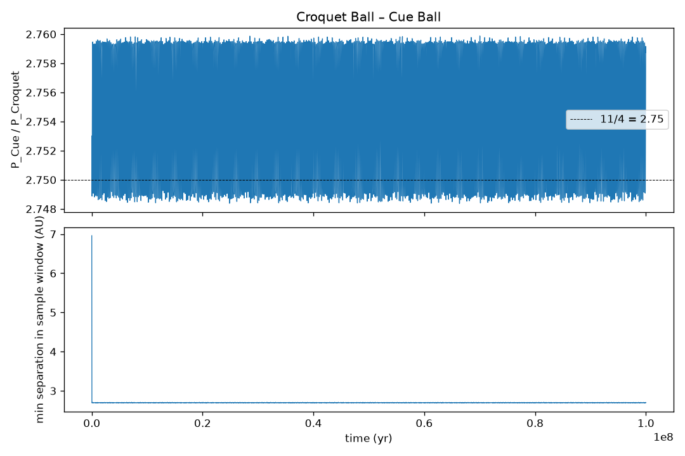

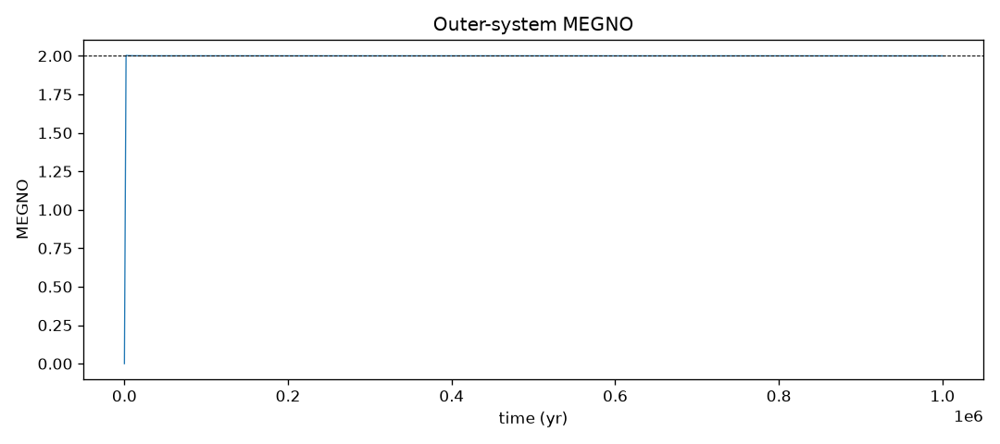

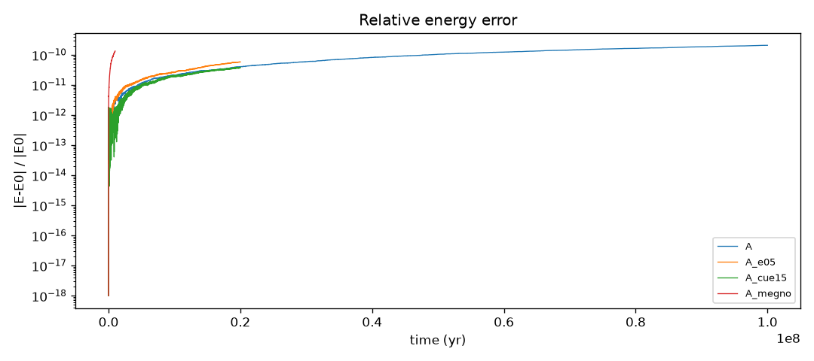

Sensitivity, giants started at e = 0.05, 20 Myr. Semi-major axes stay within a few ×10⁻² AU of the start. Eccentricity ranges: Croquet 0.0449 – 0.0539, Cue 0.0229 – 0.0520, Eight 0.0487 – 0.0722. Croquet–Cue minimum separation falls to 2.546 AU, still 11.7 mutual Hill radii. Kakakiko's eccentricity, with Sable absent, swings from 8×10⁻⁵ up to 0.0396; the dominant Fourier period of that swing is 1.59×10⁵ yr. Eccentric giants exchange eccentricity with Kakakiko. They do not destabilize the pair over 20 Myr.

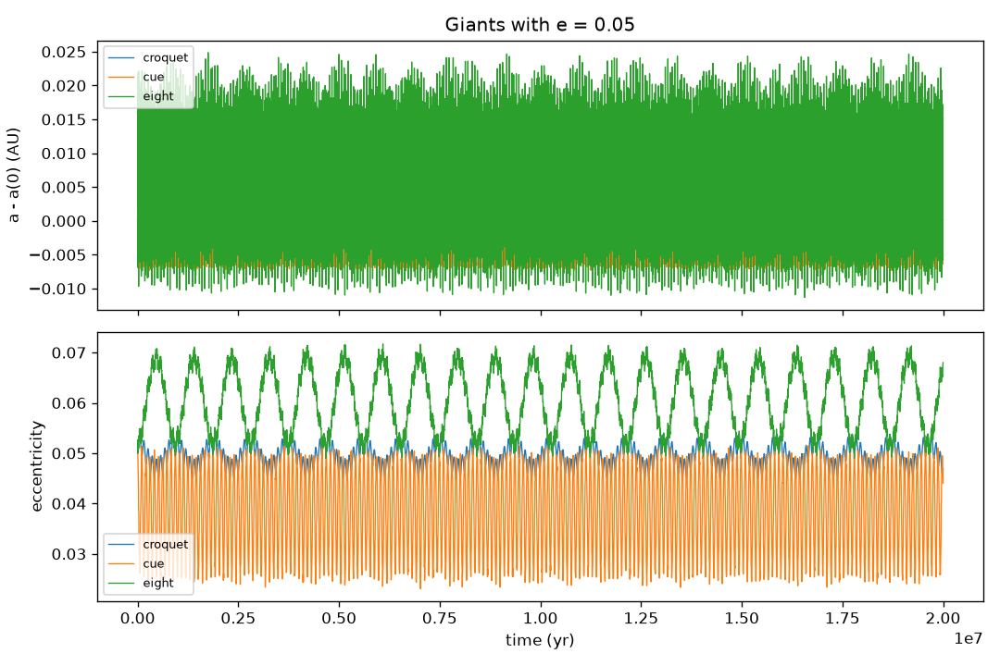

Cue Ball at 1.5× mass, 20 Myr, looks like the baseline. Croquet's eccentricity stays ≤ 6.1×10⁻⁴, Cue's ≤ 0.00251, Eight's ≤ 0.00285. Croquet–Cue minimum separation is 2.685 AU. A heavier Cue Ball does not destabilize the pair over 20 Myr.

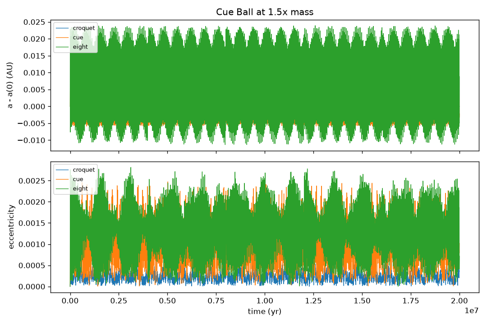

### 3.2 Kakakiko's eccentricity: marginal as a constant, orbit intact through 5 Myr

Model B is all eight planets. Sable's baseline eccentricity is the default 0. WHFast timestep 0.0027186 yr (shortest period is Gane's, 0.054921 yr).

| Run | Sable e at start | Span | Wall | max rel. energy error | Stop |
|---|---|---|---|---|---|
| B | 0 | **5 Myr** | 1652 s | 6.86×10⁻¹¹ | reached target |
| B_sable005 | 0.05 | **2 Myr** | 675 s | 2.38×10⁻¹¹ | reached target |
| B_sable01 | 0.1 (the Locked ceiling) | **2 Myr** | 695 s | 1.58×10⁻¹¹ | reached target |

With Sable started at e = 0, over 5 Myr:

- Kakakiko e = 0.01362 – 0.04011, mean 0.02819. The dominant Fourier period, from samples every 500 yr, is **19,687 yr**. The amplitude is steady across the 5 Myr; the plot does not show a growing envelope.
- Kakakiko a = 0.70984 – 0.71012 AU.
- The Locked 0.0396 is the top of this cycle. It is the initial condition. The time spent near 0.0396 is the top of each swing, and the typical value is near 0.028.
- Sable's own eccentricity grows from 0 to at most 0.0288. Its semi-major axis stays in 0.53796 – 0.53806 AU.
- Closest Sable–Kakakiko approach: **0.1435 AU**, which is **14.6** mutual Hill radii (mutual Hill radius 0.009830 AU). The doc's geometric worst case of 0.090 AU assumes Sable at e = 0.1 and a perfect alignment. This baseline never reaches Sable e = 0.029, so it is a different experiment from that geometric floor.
- Inner-planet semi-major axes are steady (Gane stays at 0.133000 AU, Hornstooth within 3×10⁻⁶ AU, Husk within 7×10⁻⁵ AU). Their eccentricities reach 0.0138 (Gane), 0.0438 (Hornstooth), and 0.0403 (Husk).
- The giants in this full system match run A: Croquet e ≤ 5.4×10⁻⁴, Cue e ≤ 0.00257, Eight e ≤ 0.00280. Croquet–Cue minimum separation 2.685 AU.

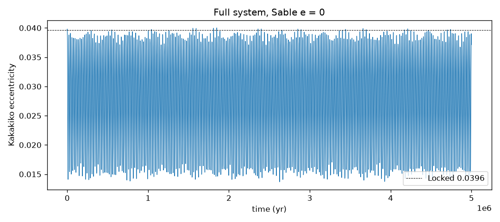

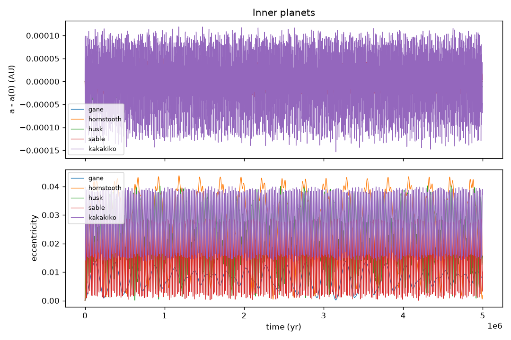

Sable started at e = 0.05, over 2 Myr. Kakakiko e = 0.03349 – 0.04621, mean 0.03991, Fourier period 20,207 yr. Here 0.0396 is the middle of a small swing. Sable's eccentricity stays in 0.0417 – 0.0501. Closest approach **0.1642 AU** (16.7 mutual Hill radii). Hornstooth's eccentricity reaches 0.138. Semi-major axes do not wander.

Sable started at e = 0.1, over 2 Myr. Kakakiko e = 0.02989 – 0.1055, mean 0.0716, Fourier period 19,236 yr. Sable's eccentricity falls as low as 0.0570 and returns to the initial 0.1. Closest approach **0.1320 AU** (13.4 mutual Hill radii). The doc's 0.090 AU geometric minimum was not reached in these 2 Myr: the highest eccentricities and the conjunction are not simultaneous. Inner-planet eccentricities reach 0.138 (Gane), 0.251 (Hornstooth), and 0.134 (Husk), while their semi-major axes stay put. No orbit crossing and no Hill-sphere stop.

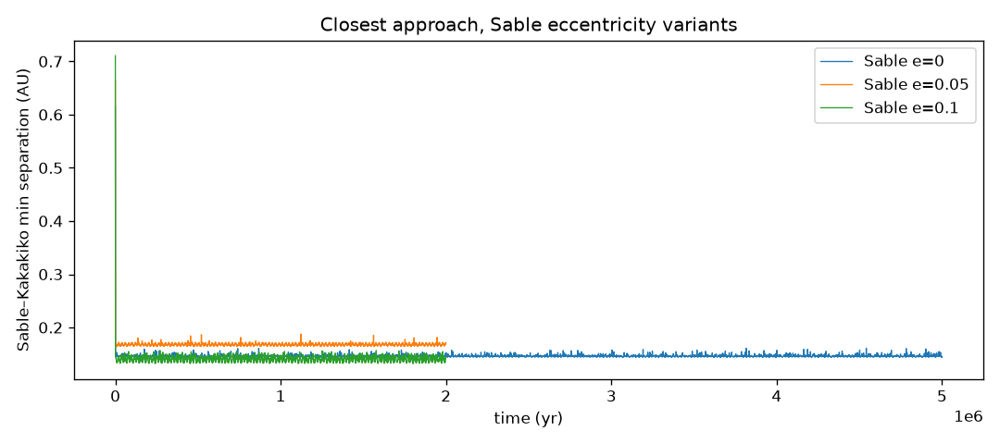

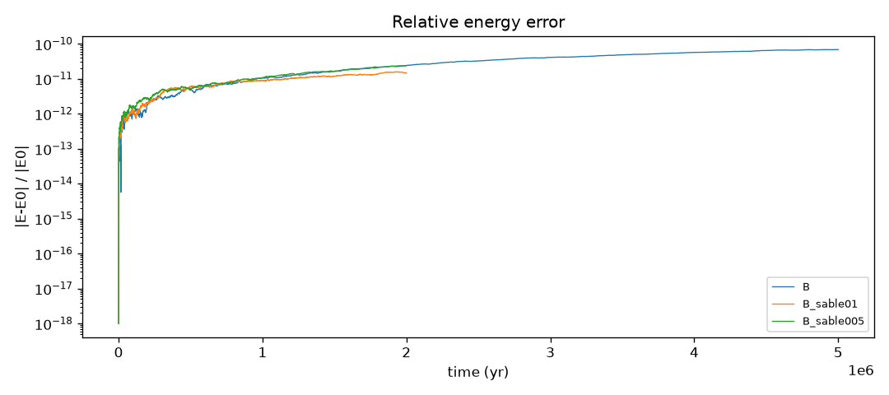

Husk–Sable is near a 2:1 period ratio and Sable–Kakakiko is near a 3:2 in the doc. Those resonant angles were not tracked. The period ratios are real; a lock was not tested.

### 3.3 Der's orbit, and the Der–Shudder 2:1

Model C, as the task specified, is the star, Sable, Kakakiko, Shudder, Der, and Croquet Ball. Gane, Hornstooth, Husk, Cue Ball, and Eight Ball are omitted. The omission is justified by run C_star below: the star plus Kakakiko plus the two moons, with Sable and Croquet removed, disrupts on the same few-year timescale. Cue and Eight are farther out and less massive than Croquet, and the doc already rates Gane and Hornstooth's peak pull at Kakakiko as ≤ 7×10⁻⁷ of the star. IAS15 throughout. Moon orbits are planetocentric, then the system is moved to the center of mass.

The published elements do start at a 2:1. The period ratio is 1.999995 and φ₁ = φ₂ = 0 by the phase choice in the input table. The failure below is not a mistuned initial period.

| Run | What changed | Span | max rel. energy error | Stop |
|---|---|---|---|---|
| C | doc a, e; φ = 0; coplanar; Sable and Croquet present | **4.542 yr** | 1.32×10⁻¹⁵ | Shudder radial: r = 6.060×10⁻³ AU, outside [0.5, 2]×a0 = 1.680×10⁻³ AU |
| C_star | star + Kakakiko + two moons only | **4.242 yr** | 1.38×10⁻¹⁵ | Shudder radial, r = 4.864×10⁻³ AU |
| C_nudged | Shudder a shifted by −0.40 km so the osculating mean motions are exactly 2:1; φ₁ started at 0. **Suggestion, not a doc value** | **4.730 yr** | 7.2×10⁻¹⁶ | Shudder radial, inward: r = 6.04×10⁻⁴ AU vs a0 = 1.680144×10⁻³ AU |
| C_random | moon mean anomalies drawn from seed 20260931 | **5.646 yr** | 1.20×10⁻¹⁵ | Shudder radial, inward |
| C_tilt | moon plane tilted 12° to Kakakiko's orbit, node 0 | **4.440 yr** | 1.08×10⁻¹⁵ | Shudder radial |
| C_apo | conjunction at Shudder's apocenter, φ₁ = φ₂ = π | **1.306 yr** | 9.6×10⁻¹⁶ | Shudder radial, inward |
| C_isolated | Kakakiko + two moons, **no star** | **50,000 yr** | 5.77×10⁻¹⁴ | reached target |

Wall times for the short runs are under 0.2 s each. C_isolated took 380 s. Energy errors near 10⁻¹⁵ on the short runs mean the integrator is not the thing that ends them. The orbits leave the published band.

**With the star, published distances.** In run C, Shudder's planetocentric distance reaches 9.07×10⁵ km, which is 0.77 of Kakakiko's Hill radius (1.1715×10⁶ km) and 3.6 times Shudder's initial semi-major axis. That is the radial stop. Der at that instant is still bound: its largest planetocentric distance in the run is 4.85×10⁵ km, 0.41 of the Hill radius. Der's osculating elements over those 4.54 yr are a = 3.38×10⁵ – 4.52×10⁵ km (doc 4.00×10⁵), e = 0.020 – 0.327 (doc 0.03), i = 0. Shudder's eccentricity reaches 0.559. Both φ₁ and φ₂ cover more than 140° in either direction (concentrations 0.47 and 0.10). They do not librate. Sampled Shudder–Der separations reach 5.32×10⁴ km (1.02 moon mutual Hill radii). A Keplerian fill between the 0.1 yr samples estimates a minimum of 1.51×10⁴ km; that fill freezes the elements, which are changing quickly, so the sampled 5.32×10⁴ km is the direct measurement and the fill is only a lower estimate. Either way the pair is no longer held at the protected perigee conjunction. The doc's unprotected close approach is 1.65 mutual Hill radii, about 8.6×10⁴ km.

The same end, to within about a year, happens with Sable and Croquet removed (C_star), with the moon plane tilted by the Locked 12° (inclinations wander, Shudder 7°–23° and Der 9°–13°, and the run still dies at 4.44 yr), with random moon phases (5.65 yr), and with conjunction at apocenter (1.31 yr, the fastest). The star's tide at 0.34 of the Hill radius is enough. Sable and Croquet are not required.

**The −0.40 km nudge does not help.** Tuning Shudder from 251,350.00 km to 251,349.60 km makes the initial osculating mean motions an exact 2:1 and starts φ₁ at 0. The run dies at 4.73 yr, with Shudder falling inward of 0.5a. This suggestion fails. It is recorded so it is not tried again as a fix.

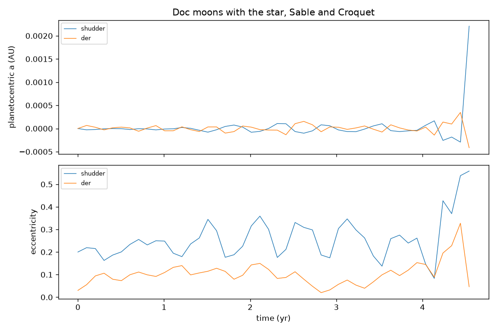

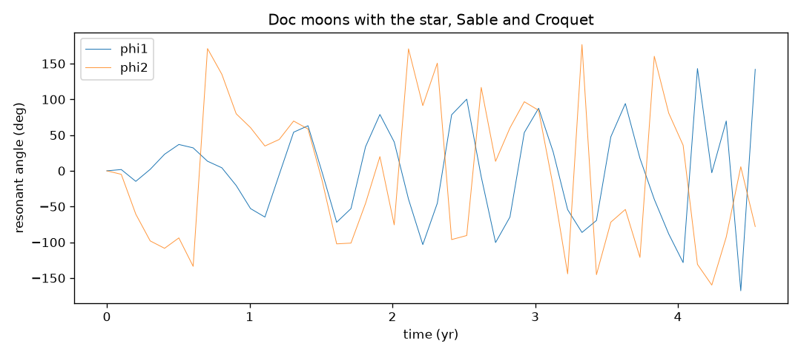

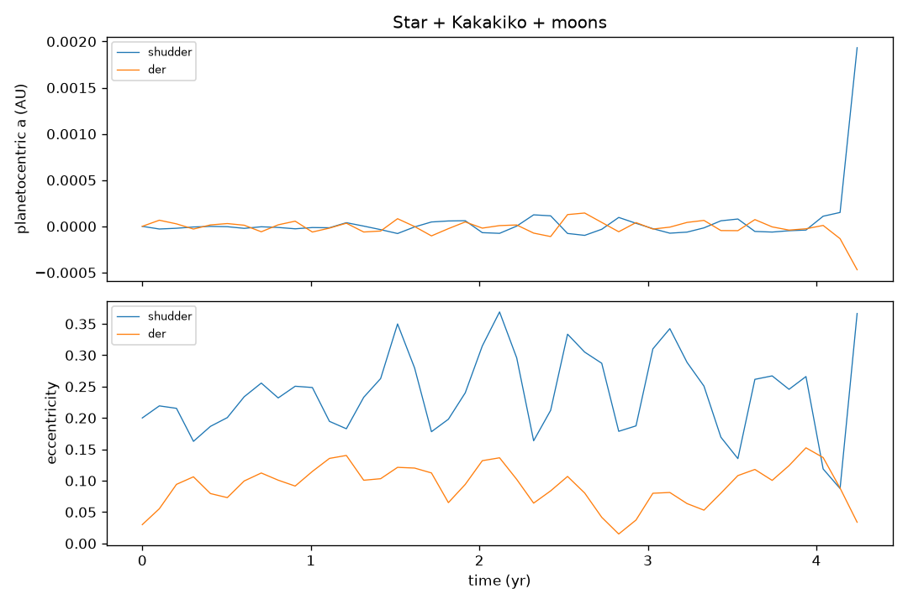

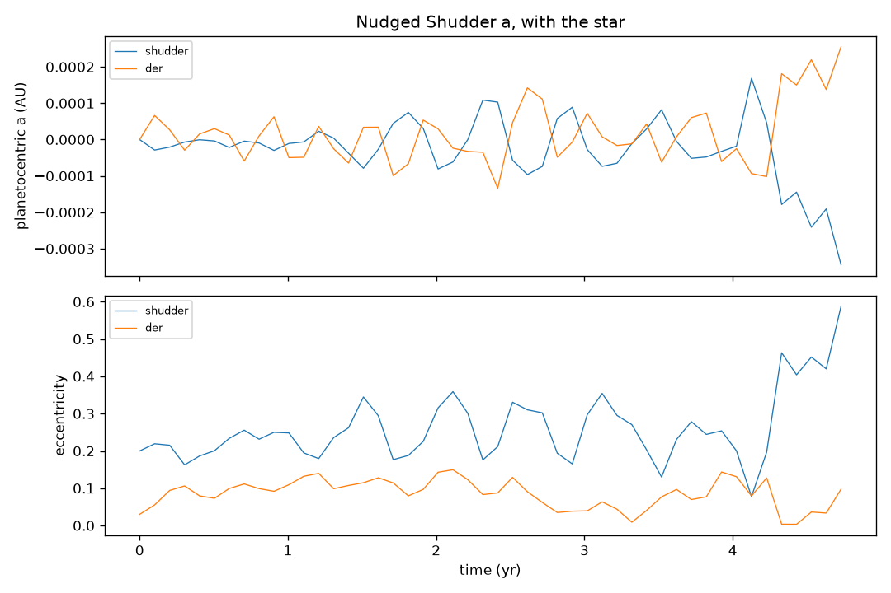

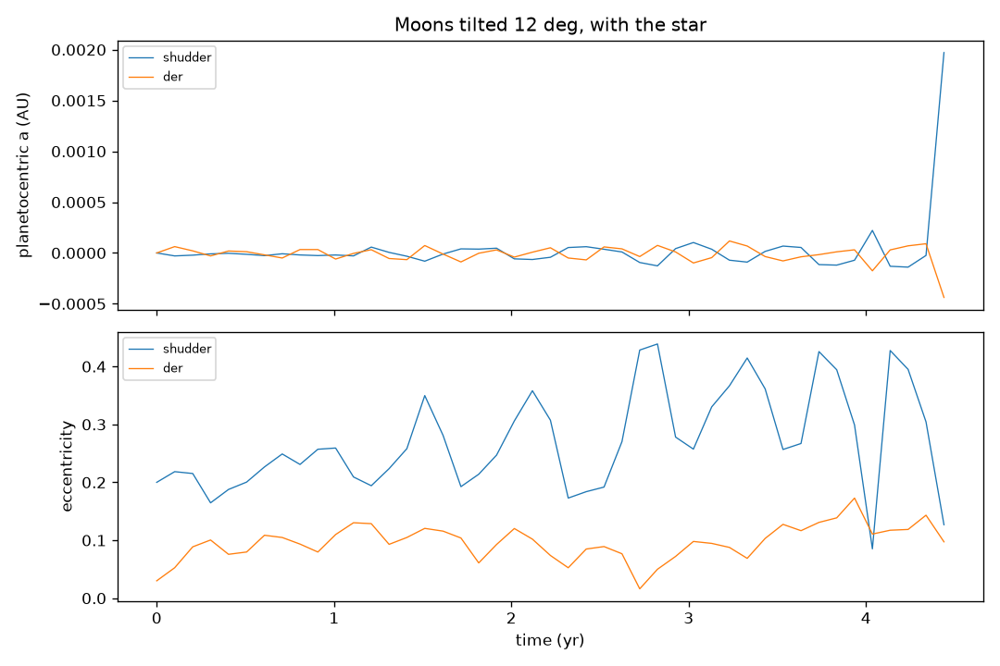

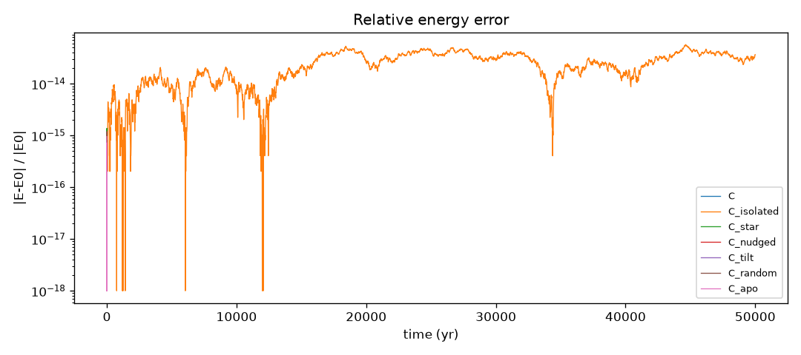

**Without the star, the published elements hold for 50,000 yr.** C_isolated is Kakakiko plus the two moons at the doc a and e, φ₁ = φ₂ = 0, IAS15.

- Shudder a = 2.429×10⁵ – 2.5135×10⁵ km, e = 0.183 – 0.245 (doc 0.20).
- Der a = 3.921×10⁵ – 4.030×10⁵ km, e = 3.8×10⁻⁵ – 0.0366 (doc 0.03), i = 0.
- Der stays on a bound ellipse about Kakakiko. There is no stellar Hill sphere in this run. The largest planetocentric distance is 4.09×10⁵ km.
- φ₁ **librates about 0°** (center −0.02°) with peak amplitude **±27.2°** and rms 15.0°. Concentration 0.966. Five successive 10,000 yr blocks each stay inside ±27.2°. The amplitude does not grow.
- That is the doc's "they line up only when Shudder is at perigee," as a libration: conjunctions stay within 27° of Shudder's pericenter. They are not pinned exactly at perigee.
- φ₂ is not locked. Its samples cover the full circle. Der's eccentricity repeatedly falls near zero (minimum 3.8×10⁻⁵), and the osculating pericenter is then poorly defined, so φ₂ = 2λ_Der − λ_Shudder − ϖ_Der swings even at a 0.01 yr cadence. The angle that carries the perigee-conjunction condition is φ₁, and that one librates.
- Closest sampled separation is 1.869×10⁵ km (3.58 mutual Hill radii). A Keplerian fill between samples estimates 1.360×10⁵ km (2.60 mutual Hill radii). Both sit well outside the doc's unprotected 1.65 mutual Hill radii. The resonance keeps the conjunction on the safe side of the geometry.

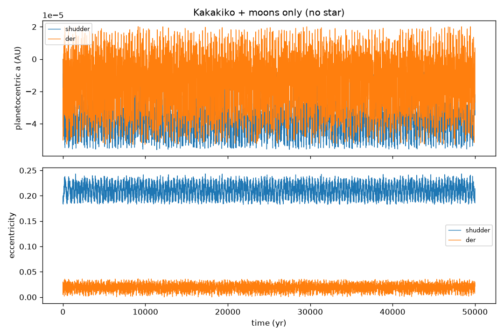

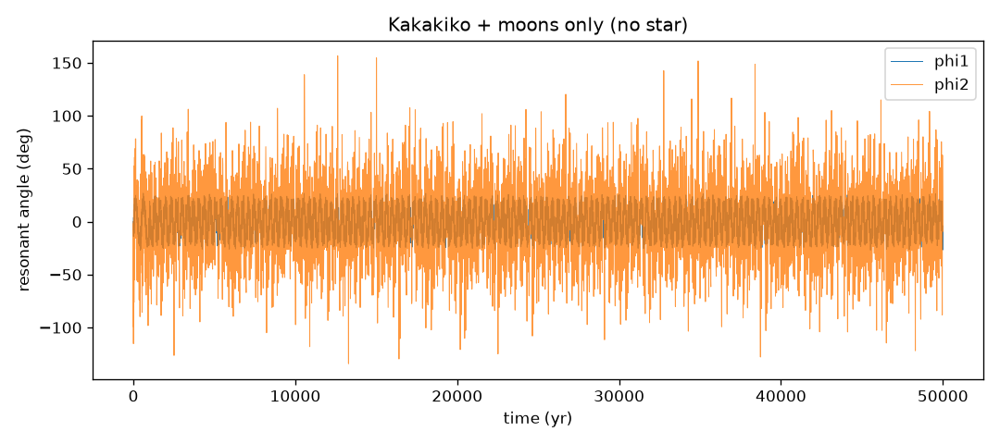

### 3.4 Lagrange clouds

**Croquet Ball L4 and L5: stable through 4.54 Myr.** Run D_croquet uses model A's planets (Sable's mass is inside the star, not a separate body) plus 25 massless particles at each of L4 and L5, on a 5×5 grid of ±0.01 AU and ±5° in longitude. WHFast, dt = 0.033531 yr, output every 20 yr. Span **4.542 Myr**, wall 1109 s, max relative energy error 1.05×10⁻¹¹, stopped on the 500 s chunk limit (the run target in the script is 20 Myr; this is as far as the chunks went).

All 25 L4 particles are tadpoles at the end, and all 25 L5 particles are tadpoles. None became horseshoes and none were lost. Libration half-amplitudes at 4.54 Myr: L4 median 5.57°, maximum 8.65°; L5 median 5.47°, maximum 8.73°. The running median of those amplitudes levels off at 5.52°, which is the width of the initial ±5° cloud. It does not grow. The closest any particle comes to Cue Ball is 2.681 AU, the same order as the Croquet–Cue planetary minimum (2.687 AU in this run). Cue Ball causes no losses over this span.

The doc already records a separate 10⁵ yr REBOUND sanity check with particles at L4, L5, and ±15°, including Sable as its own body. This run is longer, uses a tighter cloud, and folds Sable into the star. Run B shows Sable does not stir the giants (Croquet's eccentricity stays under 6×10⁻⁴), so the missing separate Sable is a small difference at 2.8 AU. The two checks agree over the overlap, and this one extends the tadpole survival to 4.54 Myr. It does not reach A's 100 Myr.

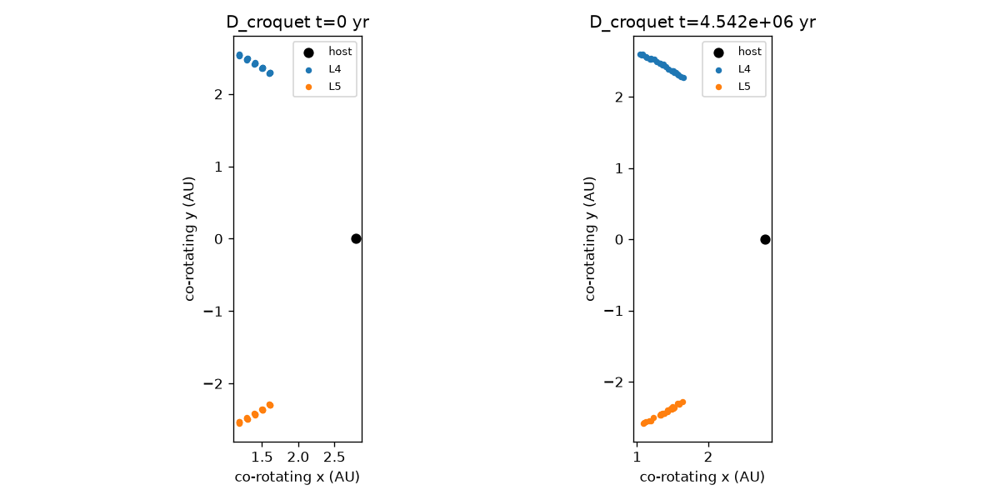

**Yard and Haven: unstable, lost with the moons by 4.5 yr.** Run D_der places 25 massless particles at Der's L4 and 25 at L5, ±1% of Der's semi-major axis and ±5° in longitude, inside model C (star, Sable, Kakakiko, Shudder, Der, Croquet). IAS15. The run stops at **4.507 yr** on the same Shudder radial condition as run C. Max relative energy error 8.4×10⁻¹⁶. Wall 3.5 s.

Routh's criterion says the circular restricted problem is linearly stable here: Kakakiko/Der = 100, and the critical mass ratio is about 24.96 (μ = m_Der/(m_Kak+m_Der) = 1/101 = 0.00990, under 0.0385). That criterion has no Shudder and no star. In the integration the particles start as tadpoles, the tadpole count is already under 25 by 0.75 yr, and **zero particles are still tadpoles at 1.75 yr**. At the stop, both clouds are entirely in the lost class (25 and 25). The loss happens during the same eccentricity pumping that breaks the moons, before the formal radial stop at 4.51 yr. A control with Shudder removed was not run, so Shudder's perturbation is not separated from the stellar tide. What was measured is that Yard and Haven do not survive the published moon configuration.

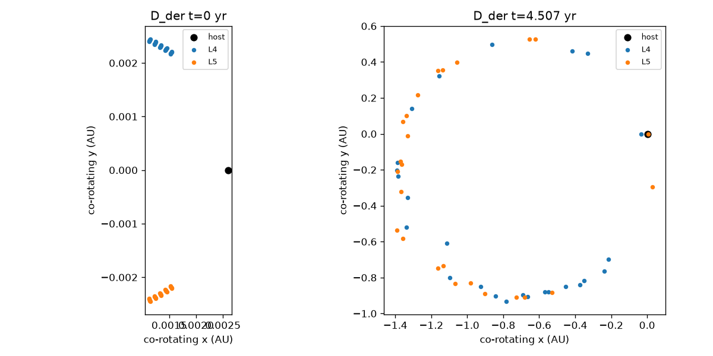

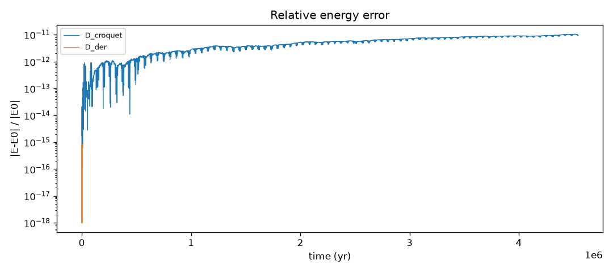

## 4. Measured vs estimated

Measured, inside the span of each run:

- No ejection, no orbit crossing, and no mutual-Hill encounter among the eight planets, through 100 Myr for the outer system and 5 Myr for the full system at Sable e = 0.
- MEGNO = 2.00 through 1 Myr in the outer system. No positive Lyapunov exponent in those samples.
- Kakakiko e ∈ [0.01362, 0.04011] over 5 Myr at Sable e = 0, Fourier period 19,687 yr, mean 0.02819. At Sable e = 0.05, e ∈ [0.03349, 0.04621] over 2 Myr, mean 0.03991. At Sable e = 0.1, e ∈ [0.02989, 0.1055] over 2 Myr.
- Sable–Kakakiko closest approach 0.1435 AU (e = 0, 5 Myr), 0.1642 AU (e = 0.05, 2 Myr), 0.1320 AU (e = 0.1, 2 Myr).
- Published moons with the star: disruption at 4.2 – 5.6 yr depending on phase and companions, 1.3 yr if conjunction starts at Shudder's apocenter. Relative energy error ~10⁻¹⁵.
- Published moons without the star: φ₁ libration amplitude ±27.2° about 0°, steady across 50,000 yr. Der's a stays within about 2% of 400,000 km.
- Croquet L4 and L5: 50/50 tadpoles at 4.54 Myr, amplitudes 5.5°–8.7°.
- Yard and Haven: 0/50 tadpoles by 1.75 yr.

Not measured, and not claimed:

- Stability over the system's age (the doc's stellar age is several Gyr; 100 Myr is the longest integration here). A flat MEGNO over 1 Myr and a non-growing 20 kyr eccentricity cycle over 5 Myr are consistent with regular motion on those spans. They are not a Gyr proof.
- Whether Croquet's Trojans survive to 100 Myr or to a Gyr. The amplitude did not grow over 4.54 Myr. That is as far as the integration went.
- Whether φ₁ at the published distances would librate for longer than 50,000 yr with the star removed. It was steady through the span that was run.
- A resonant lock of the Croquet–Cue 11:4, the Husk–Sable 2:1, or the Sable–Kakakiko 3:2. Only the period ratios, and the Der–Shudder angles, were tracked.
- The doc's geometric Sable–Kakakiko minimum of 0.090 AU. The e = 0.1 run's closest approach was 0.132 AU. The extremes of the two eccentricities were not simultaneous, so 0.090 AU was neither confirmed nor ruled out as a possible future alignment.
- Yard/Haven on any moon orbit other than the published one.

The inward-scaled moon orbits in the next section are suggestions. Their survival times are measured. They are not doc values.

## 5. Suggestions for Doug

Nothing here was written back into the setting doc.

- **Croquet Ball ~95 M⊕, Cue Ball ~17 M⊕, Eight Ball 13 M⊕ (Locked).** The 100 Myr baseline, the 20 Myr run with giant e = 0.05, the 20 Myr run with Cue at 25.5 M⊕, and 1 Myr of MEGNO ≈ 2 all leave the giant pair intact, with Croquet–Cue never closer than 2.55 AU. The doc asked for an N-body check before locking the giant masses. Over these spans the check does not put those masses at risk. It also does not reach a Gyr.
- **Kakakiko e = 0.0396 (Locked).** The number is a real initial condition, and it is stable when the inner planets are folded into the star. Once Sable and the inner planets are present and Sable starts circular, 0.0396 is the **maximum** of a 19,700 yr cycle whose average is 0.028. If Sable's eccentricity is about 0.05, 0.0396 is instead the average of a much smaller swing (0.033 – 0.046). Climate notes that treat 0.0396 as the eccentricity are using the top of the circular-Sable cycle. The planet is not at risk of crossing Sable over 5 Myr.
- **Sable e ≤ 0.1 (Locked ceiling).** At the ceiling, 2 Myr produces no Sable–Kakakiko crossing (closest 0.132 AU, against the doc's geometric 0.090 AU). The same run pumps Hornstooth's eccentricity to 0.25, Gane's to 0.14, and Husk's to 0.13, and Kakakiko's to 0.106, all from initially circular inner orbits. Those semi-major axes hold. If Gane, Hornstooth, and Husk are meant to stay near-circular, Sable's eccentricity wants to sit nearer 0 to 0.05 than on the ceiling. At 0.05, Kakakiko's eccentricity stays next to the Locked 0.0396.
- **Eight Ball's 13 M⊕** stays on a = 9.191 – 9.224 AU with e ≤ 0.0027 in the 100 Myr run. Supported over that span.
- **Shudder at 251,350 km, e = 0.20, and Der at 400,000 km, e = 0.03.** These are at risk as a long-lived pair around Kakakiko. Every integration that includes the star loses the published orbits within 6 yr, including the exact-2:1 nudge of −0.40 km and the 12° equatorial tilt. The doc's own tension note ("no N-body run was done; solar perturbation at 0.34 of the Hill radius") is the effect that shows up. The 2:1 **concept** is intact in a star-free integration: φ₁ librates at ±27° for 50,000 yr and the moons never reach the dangerous close approach. A capture narrative that needs these elements to survive ~100 Myr is not supported by the published distances.
- **Suggestion, not a doc value.** Both moon semi-major axes at 0.60 of the published numbers: Shudder **150,810 km**, Der **240,000 km** (0.13 and 0.20 of Kakakiko's Hill radius), same eccentricities, same conjunction-at-perigee phase. Integrated with the star, Sable, and Croquet Ball for **20,000 yr** (IAS15): survived, φ₁ stayed in [−24.5°, +24.9°], Shudder e ≤ 0.248, Der e ≤ 0.054, minimum separation 1.120×10⁵ km. A bracketing scan at 2,000 yr, star + Kakakiko + moons: scale 0.65 disrupted at 1,855 yr; 0.62, 0.60, and 0.58 survived with φ₁ inside about ±35°; 0.55 disrupted at 490 yr without companions and at 1,462 yr with Sable and Croquet. An earlier 300 yr scan had left 0.55 looking safe; the longer runs supersede that. The 20,000 yr test was done only at 0.60. Scales 0.58 and 0.62 survived 2,000 yr and were not pushed to 20,000 yr.
- **Yard and Haven at 400,000 km** are not supported as long-lived habitats on the published orbit. Both clouds were gone as tadpoles within 2 yr. Croquet Ball's L4/L5, the jump-gate site, is the cloud this integration supports, through 4.54 Myr, with libration amplitudes of a few degrees and no losses to Cue Ball.

## 6. Sources

- Setting doc, read and not edited: `F:\Dropbox\Projects\Turquenish\systems\tauCet\Tau_Cet_system_v2.md`, Draft v2.40 (2026-09-30). Sections used: §4 star, §5 overview, §6.1–6.8, the moon subsections, §7a realism and stability, §8 Trojan paragraph, §12 resonance-stability tension, and the calculation notes that give the Hill radii and the AU and M⊕ conversions.
- REBOUND 5.2.1, imported and run. matplotlib 3.11.2. numpy 2.5.2.
- Opened and verified on the web: none. No REBOUND docs page was opened. Integrator calls (`units`, WHFast `safe_mode` / `corrector` / `keep_unsynchronized` / `coordinates`, IAS15 `epsilon`, `Simulationarchive`, `init_megno`, `megno`, `lyapunov`, `energy`) were taken from the installed 5.2.1 package and confirmed by these runs. The first MEGNO attempt failed because MEGNO refuses WHFast `safe_mode = 0`; MEGNO runs set `safe_mode = 1`.
- Search-indexed only: none.

## 7. Reproduce

From a fresh job folder these commands rebuild the archives, because each `run_chunk.py` call resumes that run id. A call stops at 500 s of wall time, at a radial or encounter stop, or at that run's target, whichever comes first. The year argument is the requested chunk, not always the span reached. Python is the user install; the working directory may be the repo root. Scripts are invoked by full path.

```text
python -c "import rebound, matplotlib; print(rebound.__version__, matplotlib.__version__)"
python "C:\Users\DougJ\Documents\GitHub\orbit_match\tasks\rebound_tau_ceti\tau_ceti_model.py"
python "C:\Users\DougJ\Documents\GitHub\orbit_match\tasks\rebound_tau_ceti\run_chunk.py" A 2000000
python "C:\Users\DougJ\Documents\GitHub\orbit_match\tasks\rebound_tau_ceti\run_chunk.py" C 200
python "C:\Users\DougJ\Documents\GitHub\orbit_match\tasks\rebound_tau_ceti\run_chunk.py" A_megno 50000
python "C:\Users\DougJ\Documents\GitHub\orbit_match\tasks\rebound_tau_ceti\run_chunk.py" A 30000000
python "C:\Users\DougJ\Documents\GitHub\orbit_match\tasks\rebound_tau_ceti\run_chunk.py" B 600000
python "C:\Users\DougJ\Documents\GitHub\orbit_match\tasks\rebound_tau_ceti\run_chunk.py" A_e05 20000000
python "C:\Users\DougJ\Documents\GitHub\orbit_match\tasks\rebound_tau_ceti\run_chunk.py" C_nudged 500
python "C:\Users\DougJ\Documents\GitHub\orbit_match\tasks\rebound_tau_ceti\run_chunk.py" C_isolated 1000
python "C:\Users\DougJ\Documents\GitHub\orbit_match\tasks\rebound_tau_ceti\run_chunk.py" C_apo 1000
python "C:\Users\DougJ\Documents\GitHub\orbit_match\tasks\rebound_tau_ceti\run_chunk.py" C_random 500
python "C:\Users\DougJ\Documents\GitHub\orbit_match\tasks\rebound_tau_ceti\run_chunk.py" C_tilt 500
python "C:\Users\DougJ\Documents\GitHub\orbit_match\tasks\rebound_tau_ceti\run_chunk.py" C_star 2000
python "C:\Users\DougJ\Documents\GitHub\orbit_match\tasks\rebound_tau_ceti\run_chunk.py" C_isolated 40000
python "C:\Users\DougJ\Documents\GitHub\orbit_match\tasks\rebound_tau_ceti\moon_scan.py"
python "C:\Users\DougJ\Documents\GitHub\orbit_match\tasks\rebound_tau_ceti\run_chunk.py" A_cue15 20000000
python "C:\Users\DougJ\Documents\GitHub\orbit_match\tasks\rebound_tau_ceti\run_chunk.py" A_megno 300000
python "C:\Users\DougJ\Documents\GitHub\orbit_match\tasks\rebound_tau_ceti\run_chunk.py" D_croquet 500000
python "C:\Users\DougJ\Documents\GitHub\orbit_match\tasks\rebound_tau_ceti\run_chunk.py" B 1600000
python "C:\Users\DougJ\Documents\GitHub\orbit_match\tasks\rebound_tau_ceti\run_chunk.py" B_sable01 1000000
python "C:\Users\DougJ\Documents\GitHub\orbit_match\tasks\rebound_tau_ceti\run_chunk.py" C_isolated 20000
python "C:\Users\DougJ\Documents\GitHub\orbit_match\tasks\rebound_tau_ceti\moon_scan.py"
python "C:\Users\DougJ\Documents\GitHub\orbit_match\tasks\rebound_tau_ceti\run_chunk.py" A 40000000
python "C:\Users\DougJ\Documents\GitHub\orbit_match\tasks\rebound_tau_ceti\run_chunk.py" C_isolated 40000
python "C:\Users\DougJ\Documents\GitHub\orbit_match\tasks\rebound_tau_ceti\run_chunk.py" D_der 10000
python "C:\Users\DougJ\Documents\GitHub\orbit_match\tasks\rebound_tau_ceti\run_chunk.py" B_sable005 1000000
python "C:\Users\DougJ\Documents\GitHub\orbit_match\tasks\rebound_tau_ceti\run_chunk.py" B_sable01 1000000
python "C:\Users\DougJ\Documents\GitHub\orbit_match\tasks\rebound_tau_ceti\run_chunk.py" D_croquet 2000000
python "C:\Users\DougJ\Documents\GitHub\orbit_match\tasks\rebound_tau_ceti\run_chunk.py" A_megno 700000
python "C:\Users\DougJ\Documents\GitHub\orbit_match\tasks\rebound_tau_ceti\run_chunk.py" B 3000000
python "C:\Users\DougJ\Documents\GitHub\orbit_match\tasks\rebound_tau_ceti\moon_long.py"
python "C:\Users\DougJ\Documents\GitHub\orbit_match\tasks\rebound_tau_ceti\run_chunk.py" A 50000000
python "C:\Users\DougJ\Documents\GitHub\orbit_match\tasks\rebound_tau_ceti\run_chunk.py" D_croquet 3000000
python "C:\Users\DougJ\Documents\GitHub\orbit_match\tasks\rebound_tau_ceti\run_chunk.py" B_sable005 1000000
python "C:\Users\DougJ\Documents\GitHub\orbit_match\tasks\rebound_tau_ceti\run_chunk.py" A_megno 500000
python "C:\Users\DougJ\Documents\GitHub\orbit_match\tasks\rebound_tau_ceti\run_chunk.py" B 2000000
python "C:\Users\DougJ\Documents\GitHub\orbit_match\tasks\rebound_tau_ceti\run_chunk.py" A 20000000
python "C:\Users\DougJ\Documents\GitHub\orbit_match\tasks\rebound_tau_ceti\run_chunk.py" A_megno 100000
python "C:\Users\DougJ\Documents\GitHub\orbit_match\tasks\rebound_tau_ceti\analyze.py"
```

Notes on that sequence. `A_megno 50000` failed before any checkpoint: MEGNO is incompatible with WHFast `safe_mode = 0`. The script now turns safe mode on for MEGNO runs, and the later `A_megno` commands are the successful integration to 1 Myr. The first `C_isolated 40000` returned immediately because that run had already hit its then-current target; the resume rule was then limited to radial, encounter, escape, and collision stops. `C_isolated 20000` and the second `C_isolated 40000` are the continuation from 1,000 yr to 50,000 yr. `moon_scan.py` was edited between its two invocations: the first was a 300 yr scan at scales 1.00, 0.85, 0.70, 0.55, 0.45, 0.35; the file on disk now is the 2,000 yr bracket at 0.65, 0.62, 0.60, 0.58, 0.55. `moon_long.py` is the 20,000 yr suggestion at scale 0.60. `analyze.py` writes the plots in `plots/`.

Archives, logs, and plots together are 215 MB, under the 500 MB checkpoint budget. They were kept.

RUN FINISHED
